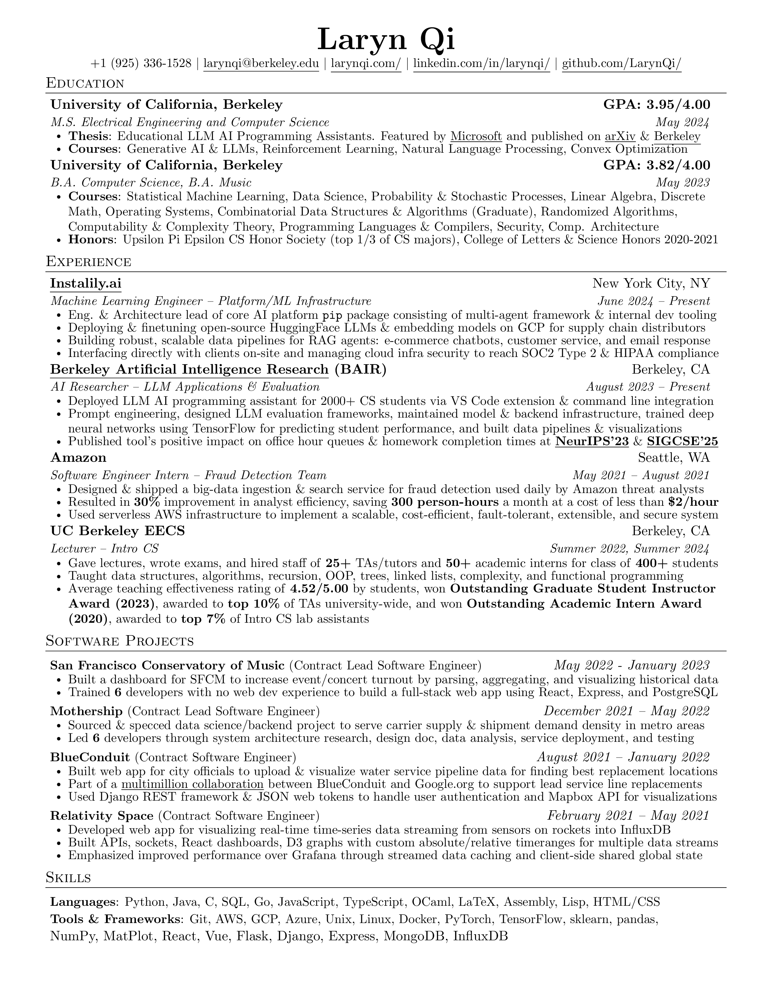

# resume

Personal resume made using [jakegut/resume](https://github.com/jakegut/resume) and [rizhu/Resume](https://github.com/rizhu/Resume).

<!-- Last updated: **<ins>2023/9/6</ins>**. -->
Last updated: **<ins>2024/12/9</ins>**.




## mac setup

`pdflatex`:
```shell
brew install --cask basictex
```

`convert`:
```shell
brew install imagemagick
```

- restart shell

install missing tex packages:
```shell
sudo tlmgr update --self
sudo tlmgr install preprint
sudo tlmgr install titlesec
sudo tlmgr install marvosym
sudo tlmgr install enumitem
```
